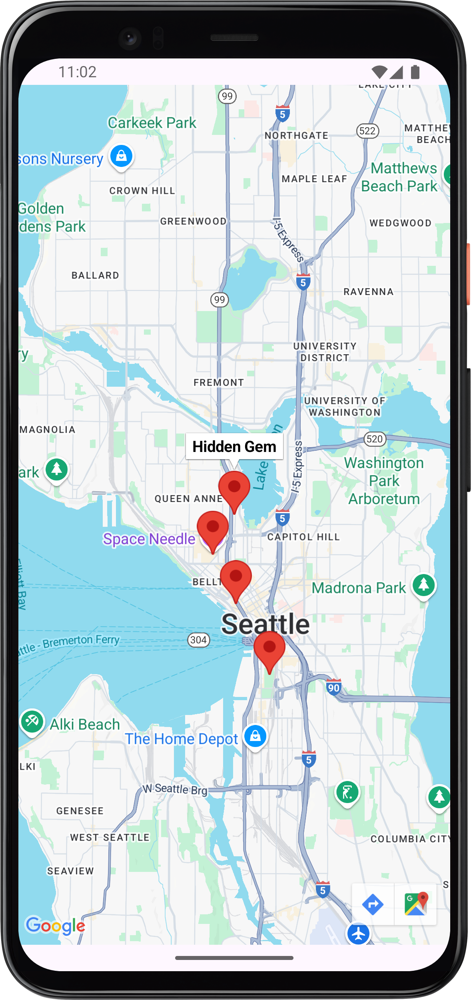

# ICTE8 Hidden Gems Map App

## Introduction

This project is an Android app based on the Google Maps API, helping users explore "hidden gems" around Seattle, WA. Users can view and discover selected spots on the map, experiencing map interaction and marker features.

---

## Features

- Integrates Google Maps to display the Seattle area
- Adds multiple "hidden gem" markers on the map (e.g., Sculpture Park, Gas Works Park, Space Needle, Pioneer Square)
- Supports map zoom and basic interactions

---

## Main File Structure

- `app/src/main/java/com/example/icte8/MainActivity.kt`  
  Main UI and map logic
- `app/src/main/res/layout/activity_main.xml`  
  Main layout with map fragment
- `app/src/main/AndroidManifest.xml`  
  Permissions and API Key config

---

## Dependencies

- Google Play Services Maps:  
  `implementation 'com.google.android.gms:play-services-maps:17.0.1'`

---

## Screenshot

